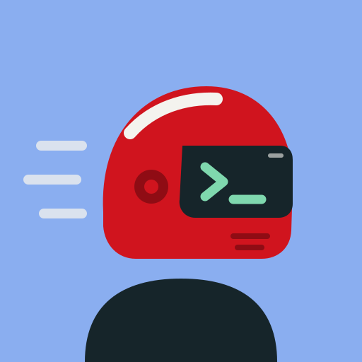

# Hi, I'm bruenu

I run Arch Linux (btw) and build small tools that take the friction out of
everyday dev work. Away from the terminal, you'll find me gaming or out on
my Panigale.

### Currently building

**[cc-picker](https://github.com/bruneler/cc-picker)** – pick a project folder
and Claude Code starts right there. A window or a terminal menu, recent
projects first, English & German.

### What I care about

- Tools that stay out of the way
- Docs that work for beginners *and* nerds
- Privacy by default: no tracking, no surprises

### Off the clock

🐧 Tweaking my Arch setup · 🎮 Gaming · 🏍️ Riding my Panigale

### Say hi

Found a bug or have an idea? Open an issue in one of my repos – I read them all.
